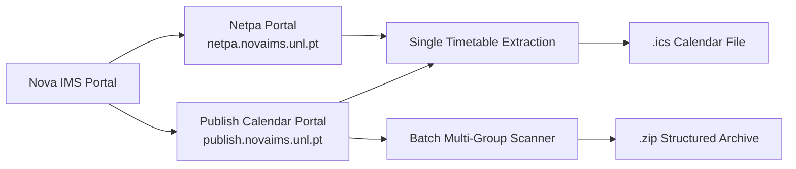
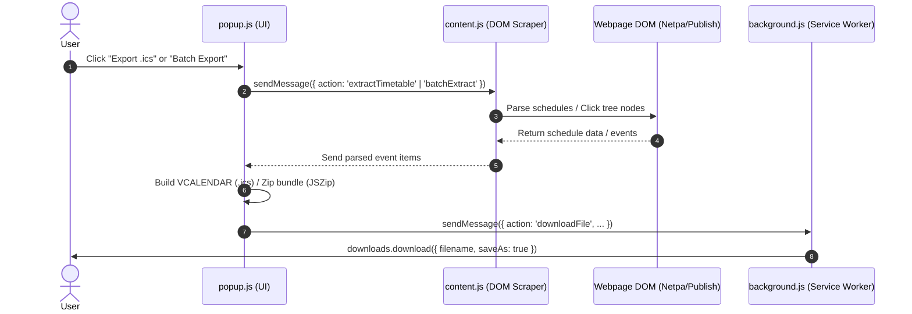

# Nova IMS Timetable Export

<div align="center">


[](https://developer.chrome.com/docs/extensions/mv3/intro/)
[](CHANGELOG.md)
[](LICENSE)
[](README.md#supported-browsers)
[](PRIVACY.md)

**A lightweight, secure browser extension to export Nova Information Management School (Nova IMS) class schedules directly to standard `.ics` (iCalendar) and `.zip` archives for seamless import into Google Calendar, Apple Calendar, and Outlook.**

[Features](#-key-features) • [Installation](#-installation) • [How to Use](#-how-to-use) • [Calendar Import Guide](#-importing-into-your-calendar) • [Architecture](#-architecture--project-structure) • [Contributing](CONTRIBUTING.md) • [Privacy](PRIVACY.md)

</div>

---

## 🌟 Overview

Nova IMS students frequently need to sync their class schedules with their personal digital calendars. However, neither the legacy **Netpa** portal nor the modern **Publish Calendar** portal provides a direct single-click iCalendar export.

**Nova IMS Timetable Export** bridges this gap:
- **Instant `.ics` Export**: Parses timetable views directly from DOM elements and downloads a valid iCalendar `.ics` file.
- **Batch Export across Programs**: Discovers all student groups from the sidebar tree, iterates over every class schedule, and packages the entire degree/cohort into organized folder structures inside a single `.zip` archive.
- **Accurate Timezone & Recurrence**: Pre-configures `Europe/Lisbon` (`WET`/`WEST` daylight saving transitions) and generates `RRULE` weekly recurring rules matching your exact semester duration.
- **100% Client-Side & Private**: Runs entirely in your browser without external servers, tracking, telemetry, or data collection.

---

## ⚡ Key Features

| Feature | Description |
| :--- | :--- |
| 📅 **Dual Portal Support** | Works with both legacy **Netpa** (`netpa.novaims.unl.pt`) and the modern Angular **Publish** portal (`publish.novaims.unl.pt/Timetable/calendar`). |
| 📦 **Batch Multi-Group Export** | Automatically navigates through student group trees, extracting schedules for all sections in a degree with real-time progress indicators. |
| 🗂️ **Organized ZIP Bundling** | Compresses batch exports into structured folder hierarchies: `[Degree] / [Year] / [Group].ics` using embedded JSZip. |
| 🔁 **Customizable Recurrence** | Configure semester duration (default: 15 weeks, adjustable 1–52 weeks) with automated `RRULE:FREQ=WEEKLY;COUNT=N`. |
| 🌍 **Timezone Compliant** | Full `VTIMEZONE` block for `Europe/Lisbon` ensures event start and end times remain accurate across Daylight Saving Time shifts. |
| 🏷️ **Rich Event Metadata** | Populates Subject, Room/Auditorium, Practical/Theoretical Group (e.g. `TP01`, `T02`), Instructor, and Duration in event notes. |
| 🐞 **Debug Logger** | Built-in debug logging with 1-click `.txt` log download to facilitate quick troubleshooting if portal DOM structures change. |

---

## 🧭 Supported Portals



1. **Legacy Netpa Portal**:
   - URL: `https://netpa.novaims.unl.pt/*`
   - Detects: `#tabhorarionew` schedule grid table.
   - Extracts: Time slots, subjects, rooms, class sections, academic year.

2. **Publish Calendar Portal**:
   - URL: `https://publish.novaims.unl.pt/Timetable/calendar`
   - Detects: `app-calendar-week-view`, `.event-grid-container`, and `app-filters-panel`.
   - Extracts: Day columns, recurring event intervals, entity details, instructor names, rooms, and student group trees.

---

## 💻 Supported Browsers

Works on all Chromium-based desktop browsers supporting Manifest V3:
- **Google Chrome** (v88+)
- **Microsoft Edge** (v88+)
- **Brave Browser**
- **Arc Browser**
- **Opera / Opera GX**
- **Vivaldi**

---

## 🚀 Installation

### Option A: Install from Release ZIP (Recommended)

1. Download the latest `nova-ims-timetable-v1.2.0.zip` from the [Releases](https://github.com/maluve05/netpa-timetable/releases) page.
2. Extract the `.zip` archive into a folder on your computer (e.g., `Documents/nova-ims-timetable`).
3. Open your browser and navigate to the Extensions management page:
   - **Chrome**: `chrome://extensions`
   - **Edge**: `edge://extensions`
   - **Brave**: `brave://extensions`
4. Toggle on **Developer mode** in the top right corner.
5. Click **Load unpacked** in the top left corner.
6. Select the extracted folder containing `manifest.json`.
7. The **Nova IMS Timetable Export** icon will appear in your browser extension toolbar! Pin it for quick access.

---

### Option B: Install from Source Code

```bash
# Clone the repository
git clone https://github.com/maluve05/netpa-timetable.git
cd netpa-timetable

# Validate extension structure & JS syntax
npm run validate

# Package production release
npm run package
```

Then load the `extension/` directory as an **Unpacked Extension** in `chrome://extensions`.

---

## 📖 How to Use

### 1. Single Timetable Export

1. Open your browser and log into [Netpa](https://netpa.novaims.unl.pt) or the [Publish Calendar](https://publish.novaims.unl.pt/Timetable/calendar).
2. Navigate to your weekly schedule / timetable page.
3. Click the **Nova IMS Timetable Export** extension icon.
4. Set the desired **Semester Weeks** count (default is `15` weeks).
5. Click **Export .ics**.
6. The file will download immediately (e.g. `nova-ims-timetable-2026.ics`).

### 2. Batch Student Groups Export (Publish Portal)

1. Navigate to `https://publish.novaims.unl.pt/Timetable/calendar`.
2. Click the extension icon and switch to the **Batch Export** tab.
3. The extension automatically scans the sidebar filter tree for available programs and student groups.
4. Choose your **Export Scope**:
   - *All Programs*: Iterates through every group in the faculty.
   - *Specific Degree*: Exports all sections for a chosen bachelor's or master's program.
5. Check or uncheck **"Organize in folders"** (`Program / Year / Group.ics`).
6. Click **Batch Export .ZIP**.
7. Watch the real-time progress bar as the extension extracts each section.
8. Once completed, a single `.zip` file containing all individual `.ics` files will download automatically.

---

## 📅 Importing into Your Calendar

Once you have downloaded your `.ics` file, follow these instructions to import it into your preferred calendar service:

### Google Calendar
1. Open [Google Calendar](https://calendar.google.com/).
2. In the top right, click the **Settings gear** ⚙️ > **Settings**.
3. In the left menu, select **Import & export**.
4. Click **Select file from your computer** and choose your exported `.ics` file.
5. Choose which calendar to add the events to (or create a separate "Nova IMS Classes" calendar first).
6. Click **Import**.

### Apple Calendar (macOS & iOS)
- **macOS**: Double-click the `.ics` file. Apple Calendar will open and prompt you to choose an existing calendar or create a new one.
- **iCloud Web**: Go to [icloud.com/calendar](https://www.icloud.com/calendar), click the gear icon in the bottom left, and choose **Import**.

### Microsoft Outlook
1. Open [Outlook Calendar](https://outlook.live.com/calendar/ or Outlook Desktop).
2. Click **Add calendar** > **Upload from file**.
3. Browse for the `.ics` file, select target calendar, and click **Import**.

---

## 🏗️ Architecture & Project Structure

```
netpa-timetable/
├── .github/
│   ├── ISSUE_TEMPLATE/
│   │   ├── bug_report.md
│   │   └── feature_request.md
│   ├── workflows/
│   │   └── validate.yml
│   └── pull_request_template.md
├── extension/
│   ├── icons/
│   │   ├── icon16.png
│   │   ├── icon48.png
│   │   └── icon128.png
│   ├── background.js       # Service worker handling downloads & filename preservation
│   ├── content.js          # DOM scrapers for Netpa and Publish calendar portals
│   ├── popup.html          # Extension popup user interface
│   ├── popup.css           # Modern theme & component styles
│   ├── popup.js            # UI logic, iCalendar generator, and ZIP pipeline
│   ├── jszip.min.js        # Client-side ZIP compression library
│   └── manifest.json       # Chrome Extension Manifest V3 configuration
├── scripts/
│   ├── validate.js         # Manifest V3 validator & JS syntax checker
│   └── package.js          # Distribution ZIP builder
├── .editorconfig
├── .gitignore
├── CHANGELOG.md
├── CHROMEWEBSTORE.md       # Chrome Web Store submission dossier & metadata
├── CONTRIBUTING.md        # Guidelines for contributing
├── LICENSE                # MIT License
├── package.json           # Development scripts & metadata
├── PRIVACY.md             # Privacy Policy (Zero data collection disclosure)
└── README.md
```

### Component Flow



---

## 🛠️ Development & Scripting

### Prerequisites
- [Node.js](https://nodejs.org/) (v18.0.0 or higher recommended)
- Any modern Chromium browser

### Available Commands

| Command | Purpose |
| :--- | :--- |
| `npm run validate` | Runs manifest schema validation, asserts icon paths, checks HTML dependencies, and tests JavaScript syntax. |
| `npm run package` or `npm run build` | Validates files and builds a compressed production `.zip` in `dist/` ready for release or Chrome Web Store upload. |
| `npm test` | Runs the test suite (`npm run validate`). |

---

## 🔒 Permissions & Security

This extension adheres strictly to the Principle of Least Privilege:

- `activeTab`: Temporarily inspects the active Nova IMS schedule tab when you open the popup.
- `scripting`: Executes content extraction logic within the active timetable page.
- `downloads`: Enables direct saving of `.ics` and `.zip` files to your Downloads folder with accurate filenames.
- `matches`: Limited exclusively to `*://netpa.novaims.unl.pt/*` and `*://publish.novaims.unl.pt/*`.

See our full [Privacy Policy](PRIVACY.md) for details.

---

## 🤝 Contributing

Contributions are warmly welcomed! Please check out [CONTRIBUTING.md](CONTRIBUTING.md) to get started with local development, reporting issues, or submitting pull requests.

---

## 📄 License

This project is open-source software licensed under the [MIT License](LICENSE).

Copyright (c) 2026 **Malvin Tafadzwa Chitswamatombo**.
